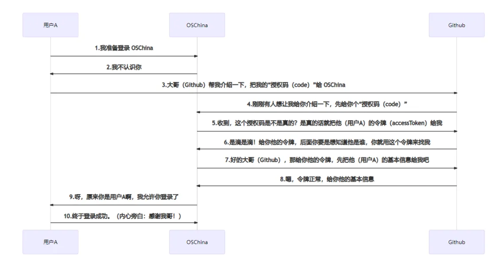
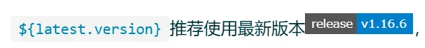

<h2 id="ctNMk">OAuth2流程</h2>



<h2 id="vh0Ry">JustAuth使用</h2>
<font style="color:rgb(0, 50, 60);">使用JustAuth总共分三步（</font>**<font style="color:rgb(0, 50, 60);">这三步也适合于JustAuth支持的任何一个平台</font>**<font style="color:rgb(0, 50, 60);">）：</font>

1. <font style="color:rgb(0, 50, 60);">申请注册第三方平台的开发者账号</font>
2. <font style="color:rgb(0, 50, 60);">创建第三方平台的应用，获取配置信息(</font>`accessKey`<font style="color:rgb(0, 50, 60);">,</font><font style="color:rgb(0, 50, 60);"> </font>`secretKey`<font style="color:rgb(0, 50, 60);">,</font><font style="color:rgb(0, 50, 60);"> </font>`redirectUri`<font style="color:rgb(0, 50, 60);">)</font>
3. <font style="color:rgb(0, 50, 60);">使用该工具实现授权登陆</font>

<h3 id="C8ntc">使用方式</h3>

+ 引入依赖

```xml
<dependency>
    <groupId>me.zhyd.oauth</groupId>
    <artifactId>JustAuth</artifactId>
    <version>${latest.version}</version>
</dependency>
```

[最新版本](https://search.maven.org/search?q=g:me.zhyd.oauth%20AND%20a:JustAuth)



+ 调用api

```java
// 创建授权request
AuthRequest authRequest = new AuthGiteeRequest(AuthConfig.builder()
        .clientId("clientId")
        .clientSecret("clientSecret")
        .redirectUri("redirectUri")
        .build());
// 生成授权页面
authRequest.authorize("state");
// 授权登录后会返回code（auth_code（仅限支付宝））、state，1.8.0版本后，可以用AuthCallback类作为回调接口的参数
// 注：JustAuth默认保存state的时效为3分钟，3分钟内未使用则会自动清除过期的state
authRequest.login(callback);
```

<h2 id="api分解"><font style="color:rgb(0, 50, 60);">  
</font><font style="color:rgb(0, 50, 60);">API分解</font></h2>
**<font style="color:rgb(0, 50, 60);">JustAuth</font>**<font style="color:rgb(0, 50, 60);">的核心就是一个个的</font>`request`<font style="color:rgb(0, 50, 60);">，每个平台都对应一个具体的</font>`request`<font style="color:rgb(0, 50, 60);">类，所以在使用之前，需要就具体的授权平台创建响应的</font>`request`

```java
// 创建授权request
AuthRequest authRequest = new AuthGiteeRequest(AuthConfig.builder()
                                               .clientId("clientId")
                                               .clientSecret("clientSecret")
                                               .redirectUri("redirectUri")
                                               .build());
```

### 获取授权
```java
String authorizeUrl = authRequest.authorize("state");
```


<font style="color:rgb(0, 50, 60);">获取到</font> `authorizeUrl` <font style="color:rgb(0, 50, 60);">后，可以手动实现redirect到</font>`authorizeUrl`<font style="color:rgb(0, 50, 60);">上</font>

**<font style="color:rgb(0, 50, 60);">伪代码</font>**

```java
/**
 * 
 * @param source 第三方授权平台，以本例为参考，该值为gitee（因为上面声明的AuthGiteeRequest）
 */
@RequestMapping("/render/{source}")
public void renderAuth(@PathVariable("source") String source, HttpServletResponse response) throws IOException {
    AuthRequest authRequest = getAuthRequest(source);
    String authorizeUrl = authRequest.authorize(AuthStateUtils.createState());
    response.sendRedirect(authorizeUrl);
}
```

<font style="color:rgb(0, 50, 60);">注：</font>`state`<font style="color:rgb(0, 50, 60);">建议必传！</font>`state`<font style="color:rgb(0, 50, 60);">在</font>`OAuth`<font style="color:rgb(0, 50, 60);">的流程中的主要作用就是保证请求完整性，防止</font>**<font style="color:rgb(0, 50, 60);">CSRF</font>**<font style="color:rgb(0, 50, 60);">风险，此处传的</font>`state`<font style="color:rgb(0, 50, 60);">将在回调时传回</font>

### 登录获取用户信息
```java
AuthResponse response = authRequest.login(callback);
```

<font style="color:rgb(0, 50, 60);">授权登录后会返回code（auth_code（仅限支付宝）、authorization_code（仅限华为））、state，1.8.0版本后，用</font>`AuthCallback`<font style="color:rgb(0, 50, 60);">类作为回调接口的入参</font>

**<font style="color:rgb(0, 50, 60);">伪代码</font>**

```java
/**
 * 
 * @param source 第三方授权平台，以本例为参考，该值为gitee（因为上面声明的AuthGiteeRequest）
 */
@RequestMapping("/callback/{source}")
public Object login(@PathVariable("source") String source, AuthCallback callback) {
    AuthRequest authRequest = getAuthRequest(source);
    AuthResponse response = authRequest.login(callback);
    return response;
}
```

**<font style="color:rgb(0, 50, 60);">注：第三方平台中配置的授权回调地址，以本文为例，在创建授权应用时的回调地址应为：</font>**`**[host]/callback/gitee**`

### 刷新Token（不是每个平台都支持）

```java
AuthResponse response = authRequest.refresh(AuthToken.builder().refreshToken(token).build());
```

**<font style="color:rgb(0, 50, 60);">伪代码</font>**

```java
/**
 * 
 * @param source 第三方授权平台，以本例为参考，该值为gitee（因为上面声明的AuthGiteeRequest）
 * @param token  login成功后返回的refreshToken
 */
@RequestMapping("/refresh/{source}")
public Object refreshAuth(@PathVariable("source") String source, String token){
    AuthRequest authRequest = getAuthRequest(source);
    return authRequest.refresh(AuthToken.builder().refreshToken(token).build());
}
```

<h3 id="取消授权"><font style="color:rgb(0, 50, 60);">取消授权</font></h3>

<font style="color:rgb(0, 50, 60);">注：</font>`revoke`<font style="color:rgb(0, 50, 60);">功能，并不是每个平台都支持</font>

```java
AuthResponse response = authRequest.revoke(AuthToken.builder().accessToken(token).build());
```

<font style="color:rgba(127, 127, 127, 0.5);">1</font>

**<font style="color:rgb(0, 50, 60);">伪代码</font>**

```java
/**
 * 
 * @param source 第三方授权平台，以本例为参考，该值为gitee（因为上面声明的AuthGiteeRequest）
 * @param token  login成功后返回的accessToken
 */
@RequestMapping("/revoke/{source}/{token}")
public Object revokeAuth(@PathVariable("source") String source, @PathVariable("token") String token) throws IOException {
    AuthRequest authRequest = getAuthRequest(source);
    return authRequest.revoke(AuthToken.builder().accessToken(token).build());
}
```
### 案例：
[微信小程序登录](https://www.justauth.cn/guide/oauth/wechat_mini_program/#_1-%E7%94%B3%E8%AF%B7%E5%BA%94%E7%94%A8)


